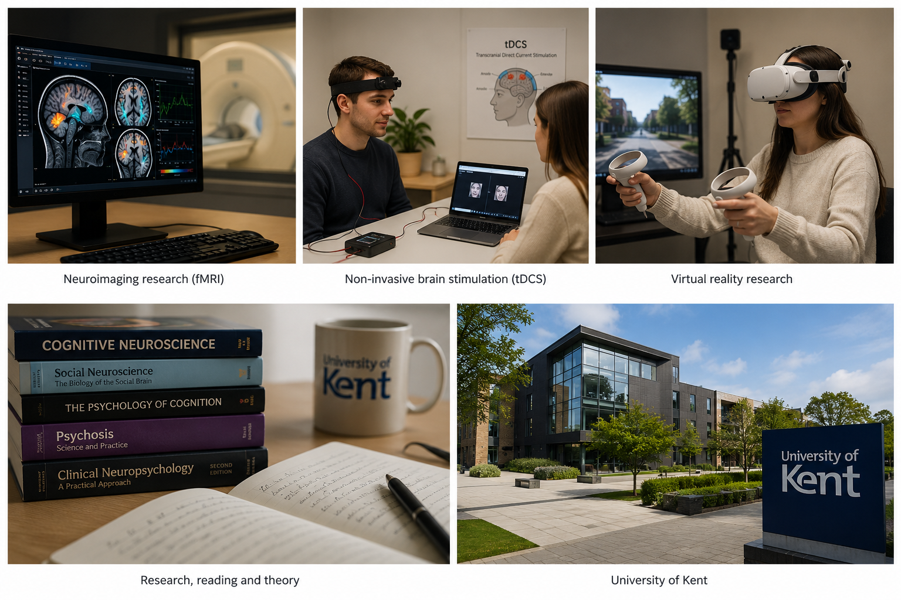

======
Welcome to Andrew Martin's Research Lab!

Martin's Research Lab investigates the cognitive, neural, and social mechanisms underlying human behaviour across healthy and clinical populations.

Our interdisciplinary research brings together experimental psychology, cognitive neuroscience, neuropsychology, clinical research, and emerging technologies to understand how people think, interact, and function across the lifespan.

Research
======

Our research spans six interconnected themes:

- **Cognition**
- **Embodied Cognition**
- **Social Interaction**
- **Social Networks**
- **Clinical Research**
- **Neurotechnology**

Together, these themes connect fundamental questions about cognition with applied research in mental health, social behaviour, ageing, and emerging technologies.

[Explore our research](https://dacians15.github.io/martins-lab.github.io/research/)

Current Research
======

*Illustrative overview of research methods and areas relevant to the lab.*

Current research within the lab examines a broad range of topics across cognitive, social, clinical, and technological research.

Areas of current interest include:

- Perspective-taking and Theory of Mind
- Sense of agency and self-referential processing
- Executive functions
- Social cognition and social neuroscience
- Psychosis and mental health
- Loneliness and social connection
- Healthy ageing and neuropsychology
- Neuroimaging and non-invasive brain stimulation
- Cognitive enhancement
- Artificial intelligence and digital mental health

Our research uses a range of experimental, neuroscientific, clinical, and quantitative methods, including cognitive testing, functional and structural neuroimaging, non-invasive brain stimulation, neurofeedback, virtual reality, and mixed-methods research.

People
======

Martin's Research Lab brings together researchers and students working across psychology, neuroscience, mental health, and human-computer interaction.

The lab is led by **Dr Andrew K. Martin**, Senior Lecturer in Cognitive Neuropsychology at the University of Kent.

[Meet the team](https://dacians15.github.io/martins-lab.github.io/people/)

Affiliations
======

Martin's Research Lab is based at the **University of Kent**, with research spanning the **School of Psychology** and **Kent and Medway Medical School (KMMS)**.

The lab also collaborates with researchers, clinicians, and organisations across academic and applied settings.

Contact
======

For research enquiries, collaboration, or student opportunities, please contact:

**Dr Andrew K. Martin**  
Senior Lecturer in Cognitive Neuropsychology  
University of Kent  
[A.K.Martin@kent.ac.uk](mailto:A.K.Martin@kent.ac.uk)
Our research draws on a range of methods, including cognitive testing, functional and structural neuroimaging, genetic approaches, and non-invasive brain stimulation.

A major focus of our clinical research is understanding cognition in mental health, with the aim of improving existing treatments and developing new approaches. We are also interested in how cognition changes across the lifespan, including healthy ageing and disorders of ageing.

