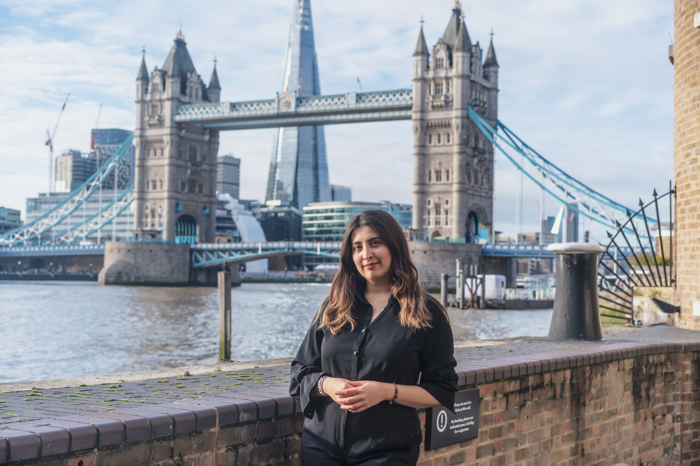

## Principal Investigator
### Dr Andrew K. Martin

**Principal Investigator**  
**Senior Lecturer in Cognitive Neuropsychology**  
*School of Psychology & Kent and Medway Medical School*  
*University of Kent*

Dr Andrew K. Martin is a cognitive neuropsychologist whose research investigates the cognitive and neural mechanisms underlying social behaviour, mental health, and individual differences in cognition. His work spans cognitive psychology, social neuroscience, clinical psychology, and cognitive neuroscience, with a particular focus on translating experimental research into a better understanding of mental health and neurological conditions.

His research examines social cognition, including perspective-taking, theory of mind, self-referential processing, sense of agency, and the cognitive processes that allow people to understand themselves and others. He is also interested in executive functions and how these cognitive abilities interact with social behaviour and mental health.

A major strand of Andrew's research focuses on psychosis and mental health. His work investigates cognitive and social-cognitive processes associated with psychosis, alongside approaches aimed at improving cognition and functioning.

Andrew's research uses a range of experimental and neuroscientific methods, including cognitive testing, functional and structural neuroimaging, genetic approaches, and non-invasive brain stimulation. His wider research interests include loneliness, healthy ageing, and disorders and pathologies associated with ageing.

He has published research in journals including *The Journal of Neuroscience*, *Cerebral Cortex*, *Neuropsychologia*, *Schizophrenia Research*, *Psychological Medicine*, and *Social Cognitive and Affective Neuroscience*.

### Research Interests

- Social Cognition
- Perspective-Taking and Theory of Mind
- Sense of Agency
- Self-Referential Processing
- Executive Functions
- Social Neuroscience
- Psychosis and Mental Health
- Cognitive Neuropsychology
- Cognitive Enhancement
- Loneliness
- Healthy Ageing and Pathologies of Ageing

### Research Methods

- Experimental Cognitive Psychology
- Functional and Structural Neuroimaging
- Non-invasive Brain Stimulation
- Cognitive and Neuropsychological Testing
- Translational and Clinical Research

### Current Research

Andrew's current research brings together cognitive neuropsychology, social neuroscience, and clinical research to investigate how cognitive and neural processes contribute to social behaviour and mental health. A particular focus of the lab is understanding cognition relevant to mental health, with the aim of informing and improving treatment approaches.

He supervises postgraduate research across social cognition, cognitive neuroscience, mental health, ageing, and related areas.

### Links

- [University of Kent Profile](https://www.kent.ac.uk/school-of-psychology/people/2978/martin-andrew)
- [ORCID](https://orcid.org/0000-0001-9445-9151)
- **Email:** [a.k.martin@kent.ac.uk](mailto:a.k.martin@kent.ac.uk)

## Research Team
### Dacian Stan

**Research Assistant & BSc Psychology Student**  
*University of Kent*

Dacian Stan is a Research Assistant in the Martin Research Lab and a BSc Psychology student at the University of Kent, entering his final year of undergraduate study. Following the completion of his professional placement year, he continues to support research within the lab alongside his studies.

His research experience spans cognitive psychology, mental health, and applied clinical research, with a particular interest in understanding cognitive and psychological processes in psychosis and other mental health difficulties. During his placement, Dacian worked across the University of Kent and Kent and Medway NHS and Social Care Partnership Trust (KMPT), gaining experience in both academic research and clinical mental health settings.

A major component of his placement involved conducting a large-scale service evaluation of an At Risk Mental State (ARMS) service, examining referral pathways, engagement, outcomes, and the recording of clinical and functional measures. He also gained experience observing multidisciplinary mental health services, including Early Intervention in Psychosis (EIP), ARMS, and Crisis Resolution and Home Treatment services.

These experiences have contributed to his developing interests in clinical psychology, cognitive neuroscience, psychosis, and the development and evaluation of psychological and neuropsychological interventions.

### Research Interests

- Clinical Psychology
- Psychosis and Early Intervention
- Cognitive Neuropsychology
- Cognitive Neuroscience
- Social Cognition
- Psychological Interventions
- Mental Health Service Evaluation
- Neuropsychological and Neurotechnological Interventions

### Current Work

Dacian continues to support research within the Martin Research Lab alongside his final year of BSc Psychology. His current work includes contributing to ongoing lab projects and the development and maintenance of the Martin Research Lab website.

### Contact

- **Email:** [ds827@kent.ac.uk](mailto:ds827@kent.ac.uk)

### Contact

- **Email:** [ds827@kent.ac.uk](mailto:ds827@kent.ac.uk)

## Melika Vafafar

**PhD Candidate in Human-Computer Interaction**  
*Northeastern University London & University of Kent*

Melika Vafafar is a PhD candidate in Human-Computer Interaction at Northeastern University London and the University of Kent. Her interdisciplinary research brings together human-computer interaction, clinical psychology, and cognitive neuroscience to explore how artificial intelligence can be designed to provide empathetic and ethically responsible support within mental health contexts.

Her research uses mixed-methods approaches, including focus groups, semi-structured interviews, surveys and questionnaires, alongside neuroimaging and neurofeedback methods including fNIRS and fMRI. She has a particular interest in participatory and co-design approaches to developing technologies that respond to the needs and experiences of the people who use them.

Alongside her doctoral research, Melika has research and professional experience across academic, clinical, and applied mental health settings, including medical school research projects, mental health organisations, schools, and honorary research roles within NHS Talking Therapies.

### Research Interests

- Human-Computer Interaction
- Empathic and Conversational AI
- AI for Mental Health
- Clinical Psychology
- Cognitive Neuroscience
- Participatory and Co-design Methods
- Neurofeedback and Neuroimaging
- Responsible and Ethical AI

### Current Research

Melika's current research examines the role of conversational and empathic AI in emotional support and mental healthcare. Her projects include:

- *"Words Are Not Enough": Examining Emotional Support by Conversational AI for Caregivers*
- *Perspectives, Opportunities and Challenges for Empathic AI in Healthcare*
- *How Women Use WhatsApp's Meta AI for Emotional Support*
- *Silent Connection: Silence as Empathic Care in Conversational AI Design*
- *The Social Brain in the Age of Artificial Minds*
- *Conversational AI Companions for Older Adults*
- *fNIRS Explorations on Opening Up to Chatbots*

### Links

- [LinkedIn](https://www.linkedin.com/in/melika-vafafar-8796051b5/)
- [Google Scholar](https://scholar.google.com/citations?user=NC2oamUAAAAJ&hl=en)
- **Email:** [Vafafar.m@northeastern.edu](mailto:Vafafar.m@northeastern.edu)

### Manal Almugathwi

**Research Fellow & PhD Candidate in Cognitive Neuropsychology**  
*Kent and Medway Medical School & University of Kent*

Manal Almugathwi is a Research Fellow at Kent and Medway Medical School (KMMS) and a PhD candidate in Cognitive Neuropsychology at the University of Kent. She completed her BSc and MSc in Psychology in Manchester and is a Senior Clinical Psychologist whose clinical experience continues to inform her research into the cognitive and neural mechanisms of social cognition in psychosis and social anxiety.

Her research explores the cognitive and neural mechanisms of social cognition in psychosis and social anxiety, with a particular focus on interpretation bias, belief updating, and paranoia. Using immersive virtual reality (VR), functional magnetic resonance imaging (fMRI), non-invasive brain stimulation (tDCS), and experimental cognitive paradigms, she investigates how people interpret ambiguous social information and how these processes shape social functioning.

Manal collaborates with researchers at King's College London to investigate the neural mechanisms of social cognition and paranoia. She was awarded competitive innovation funding through King's College London's Being Digital Creativity and Innovation in Mental Health to support the development of digital mental health research using immersive technologies. Her research has been presented at national and international scientific conferences across the UK and Europe.

### Research Interests

- Social Cognition
- Psychosis
- Social Anxiety
- Paranoia
- Interpretation Bias
- Belief Updating
- Cognitive Neuropsychology
- Virtual Reality
- Neuroimaging
- Non-invasive Brain Stimulation

### Research Methods

- Immersive Virtual Reality (VR)
- Functional Magnetic Resonance Imaging (fMRI)
- Transcranial Direct Current Stimulation (tDCS)
- Experimental Cognitive Paradigms
  
### Henry Smedley

**Research Assistant, BSc Psychology**  
*University of Kent*

Henry Smedley is a Research Assistant within the Martin Research Lab at the University of Kent.

### Contact

- **Email:** [hgs21@kent.ac.uk](mailto:hgs21@kent.ac.uk)

## Current PhD Students

- Abdulbaki Yucel
- Natasha Scott
- Chloe Bates
- Amber Pryke-Hobbs
- Manal Almugathwi

## Research Students

- Ashleigh Francis (MRes)
