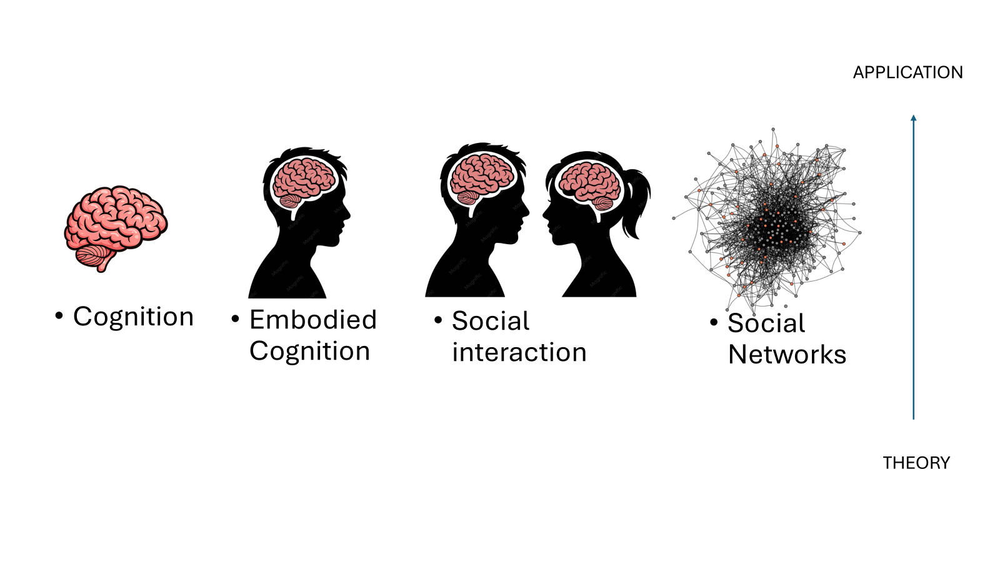

# Research

The Martin Research Lab investigates the cognitive, neural, and social mechanisms underlying human behaviour across healthy and clinical populations.

Our research ranges from fundamental questions about cognition to applied work in mental health, ageing, social behaviour, and neurotechnology.

## Research Themes

Our research spans six interconnected areas. Select a theme below to explore our current interests and approaches.

*Conceptual framework linking cognition, embodied cognition, social interaction and social networks across theoretical and applied research.*

<strong>🧠 Cognition</strong>

### Cognition

We investigate the cognitive processes that allow people to perceive, interpret, remember, and respond to information about themselves and the world around them.

Research within this theme includes:

- Executive functions
- Cognitive control and inhibition
- Memory and learning
- Decision-making
- Self-referential processing
- Sense of agency
- Perspective-taking
- Theory of mind

A particular focus of the lab is understanding how these processes vary across individuals, across the lifespan, and in clinical populations.

### Executive Functions

We study executive functions involved in cognitive control, inhibition, initiation, planning, flexible behaviour, and decision-making.

A key aim is to understand how these higher-order cognitive processes support everyday functioning and how they may differ across healthy and clinical populations.

### Sense of Agency

Sense of agency refers to the experience of being in control of one's own actions and their consequences.

Our research investigates how this experience is constructed and how cognitive and neural mechanisms contribute to the feeling of control over behaviour.

### Self-Referential Processing

We investigate how information related to the self is processed and remembered.

This includes research examining the self-reference effect and how representations of the self and other people may vary according to social and psychological factors such as loneliness.

### Perspective-Taking and Theory of Mind

Another major focus is the ability to represent perspectives, beliefs, intentions, and mental states that differ from our own.

This work contributes to a broader understanding of social cognition and the cognitive mechanisms that allow people to navigate complex social environments.

<strong>🧍 Embodied Cognition</strong>

### Embodied Cognition

Embodied cognition examines the idea that cognition cannot be understood solely as information processing within the brain.

Instead, cognitive processes emerge through interactions between the brain, body, action, and environment.

Areas of interest include:

- Sense of agency
- Self-representation
- Action and perception
- Embodied social cognition
- Bodily contributions to cognitive processing
- Interactions between cognition and the environment

Research in the lab has examined embodied perspective-taking, including the extent to which understanding another person's spatial perspective involves mentally transforming one's own bodily perspective.

Experimental and neuroscientific approaches can be used to investigate the mechanisms that support these transformations.

This work links fundamental cognitive theory with social cognition by examining how bodily representations contribute to our ability to understand and respond to other people.

<strong>👥 Social Interaction</strong>

### Social Interaction

Human cognition frequently takes place in a social context.

Our social interaction research investigates how people understand, predict, and respond to the behaviour of others, and how cognitive and neural mechanisms support successful interpersonal interaction.

Areas of interest include:

- Social cognition
- Perspective-taking
- Theory of mind
- Empathy
- Self-other representation
- Social decision-making
- Interpretation of social information
- Interpersonal behaviour

### Social Cognition

We study the processes that allow people to infer what others may be thinking or feeling and adapt their own behaviour accordingly.

These abilities are important for successful interpersonal functioning and are also relevant to a range of clinical conditions.

### Social Neuroscience

The lab uses behavioural and neuroscientific methods to investigate the neural systems that support social cognition.

This includes research using neuroimaging and non-invasive brain stimulation to test the contribution of specific brain regions to social-cognitive processes.

### Interpersonal Understanding

We are interested in how individuals integrate information about themselves, other people, and the surrounding social context.

Understanding these processes has implications for both fundamental models of cognition and clinical conditions in which social functioning may be affected.

<strong>🌐 Social Networks</strong>

### Social Networks

Beyond individual interactions, the lab is interested in how people are embedded within wider social environments and how patterns of connection, isolation, and social experience relate to cognition and wellbeing.

Areas of interest include:

- Loneliness
- Social connection
- Interpersonal relationships
- Social behaviour across the lifespan
- Social cognition within wider social environments
- Mental health and social wellbeing

### Loneliness and Social Connection

Our research investigates how loneliness relates to memory, self-referential processing, social cognition, and mental health.

Rather than treating loneliness solely as a social circumstance, this work examines how it may be reflected in the way information about the self and close others is cognitively represented.

### Social Environment and Wellbeing

We are interested in how the quantity and quality of social connection may interact with cognitive processes across the lifespan.

This provides a bridge between laboratory research on social cognition and broader questions about social functioning, wellbeing, and mental health.

<strong>🩺 Clinical Research</strong>

### Clinical Research

A major aim of the lab is to translate knowledge about cognition and the brain into a better understanding of mental health.

Clinical research in the lab has a particular focus on cognition relevant to mental health, with the longer-term goal of informing existing treatments and contributing to the development of new approaches.

Areas of interest include:

- Psychosis
- Social anxiety
- Paranoia
- Social cognition in mental health
- Interpretation bias
- Belief updating
- Cognitive functioning
- Early intervention
- Psychological wellbeing
- Ageing and neuropsychology

### Psychosis and Mental Health

We investigate cognitive and social-cognitive processes associated with psychosis and related mental health difficulties.

Areas of interest include social cognition, interpretation of social information, executive functioning, and the cognitive mechanisms that may contribute to difficulties in everyday social functioning.

### Early and Applied Mental Health Research

The lab is interested in research that connects experimental findings with real-world clinical services.

This includes work examining cognition and functioning in people experiencing, or at risk of experiencing, significant mental health difficulties.

### Ageing and Neuropsychology

Clinical and neuropsychological research also examines how cognition changes across the lifespan.

We are interested in healthy cognitive ageing as well as conditions associated with age-related cognitive decline and in approaches that may help support cognitive functioning.

<strong>⚡ Neurotechnology</strong>

### Neurotechnology

The Martin Research Lab uses neurotechnology to investigate the relationship between brain function and cognition and to explore whether cognitive processes can be experimentally measured or modulated.

Methods and technologies used across the lab include:

- Functional magnetic resonance imaging (fMRI)
- Functional near-infrared spectroscopy (fNIRS)
- Transcranial direct current stimulation (tDCS)
- Non-invasive brain stimulation
- Neurofeedback
- Immersive virtual reality
- Digital mental health technologies
- Artificial intelligence and conversational AI

### Non-Invasive Brain Stimulation

One method used in the lab's research is transcranial direct current stimulation (tDCS), a non-invasive technique that applies a weak electrical current to the scalp.

Brain stimulation can be combined with cognitive tasks to investigate whether particular brain regions contribute causally to specific cognitive or social-cognitive processes.

### Neuroimaging

Functional and structural neuroimaging are used to investigate brain systems associated with cognition, social behaviour, and mental health.

These methods allow researchers to examine how differences in brain structure and activity relate to behavioural and cognitive processes.

### Cognitive Enhancement

The lab is interested in approaches that may enhance or support cognitive functioning.

This work sits at the intersection of cognitive neuroscience, neuropsychology, and translational research and considers how neuroscientific methods might contribute to clinically meaningful interventions.

### Technology and Artificial Intelligence

The lab also has a growing interest in how people interact with emerging technologies, including artificial intelligence.

This includes questions about how technology influences cognition and social interaction and how new technologies might be developed or evaluated within mental health and healthcare contexts.

## From Theory to Application

The lab's research spans a continuum from fundamental theoretical questions about cognition through to applied research in social, clinical, and technological contexts.

The six themes are closely connected. Research into fundamental cognition can inform our understanding of social interaction, while research into social cognition can contribute to clinical applications and the development of new neurotechnologies.

This approach allows the lab to investigate human behaviour at multiple levels, from cognitive and neural mechanisms to interpersonal interactions and wider social environments.

## Research Methods

Research across the lab draws on a broad range of experimental, neuroscientific, clinical, and quantitative approaches.

- Experimental Psychology
- Cognitive Neuroscience
- Neuropsychology
- Functional Neuroimaging
- Functional Magnetic Resonance Imaging (fMRI)
- Functional Near-Infrared Spectroscopy (fNIRS)
- Non-invasive Brain Stimulation
- Transcranial Direct Current Stimulation (tDCS)
- Neurofeedback
- Virtual Reality
- Clinical Research
- Behavioural Science
- Surveys and Questionnaires
- Interviews and Focus Groups
- Systematic Reviews and Meta-Analyses

## Research Philosophy

The Martin Research Lab takes an interdisciplinary approach to understanding human cognition and behaviour.

By combining theoretical, experimental, neuroscientific, clinical, and technological perspectives, our aim is to understand not only how cognitive and social processes work, but also how this knowledge can be translated into meaningful applications.

This includes improving our understanding of mental health, supporting healthy cognitive functioning across the lifespan, and exploring how emerging technologies can be used to study and support human cognition.
